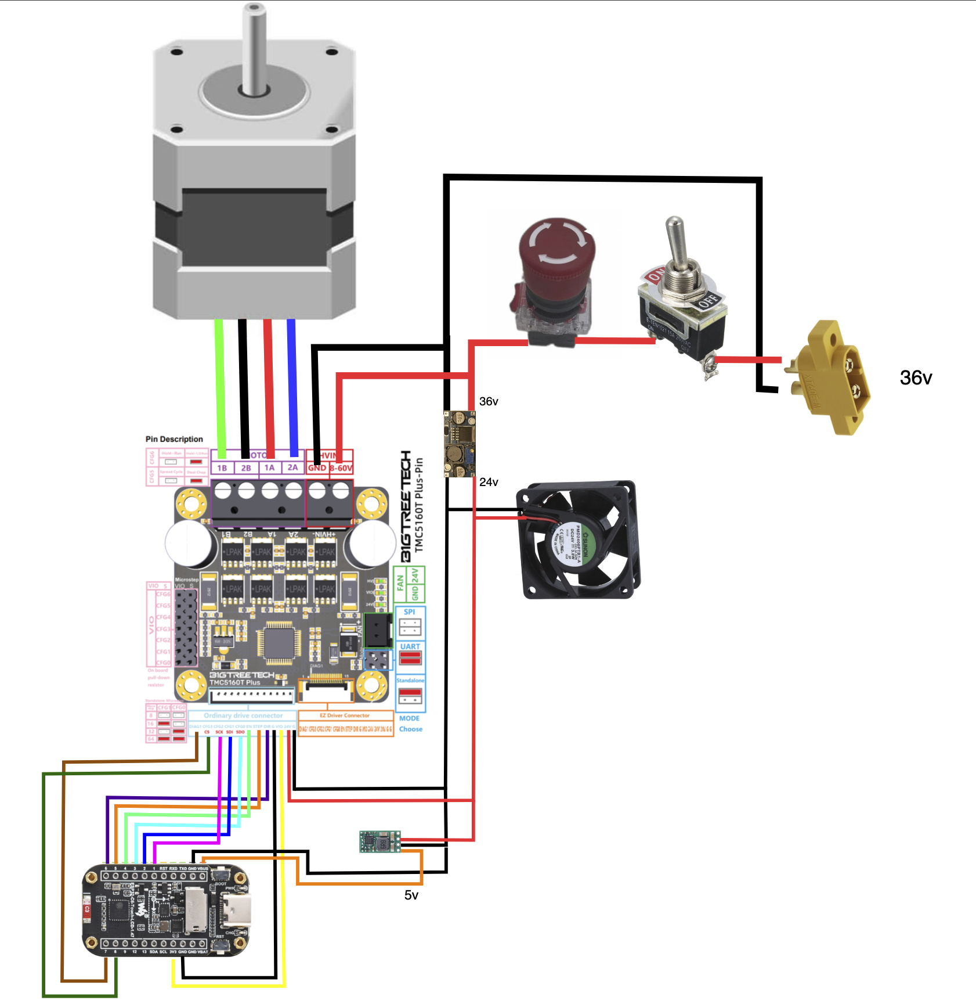
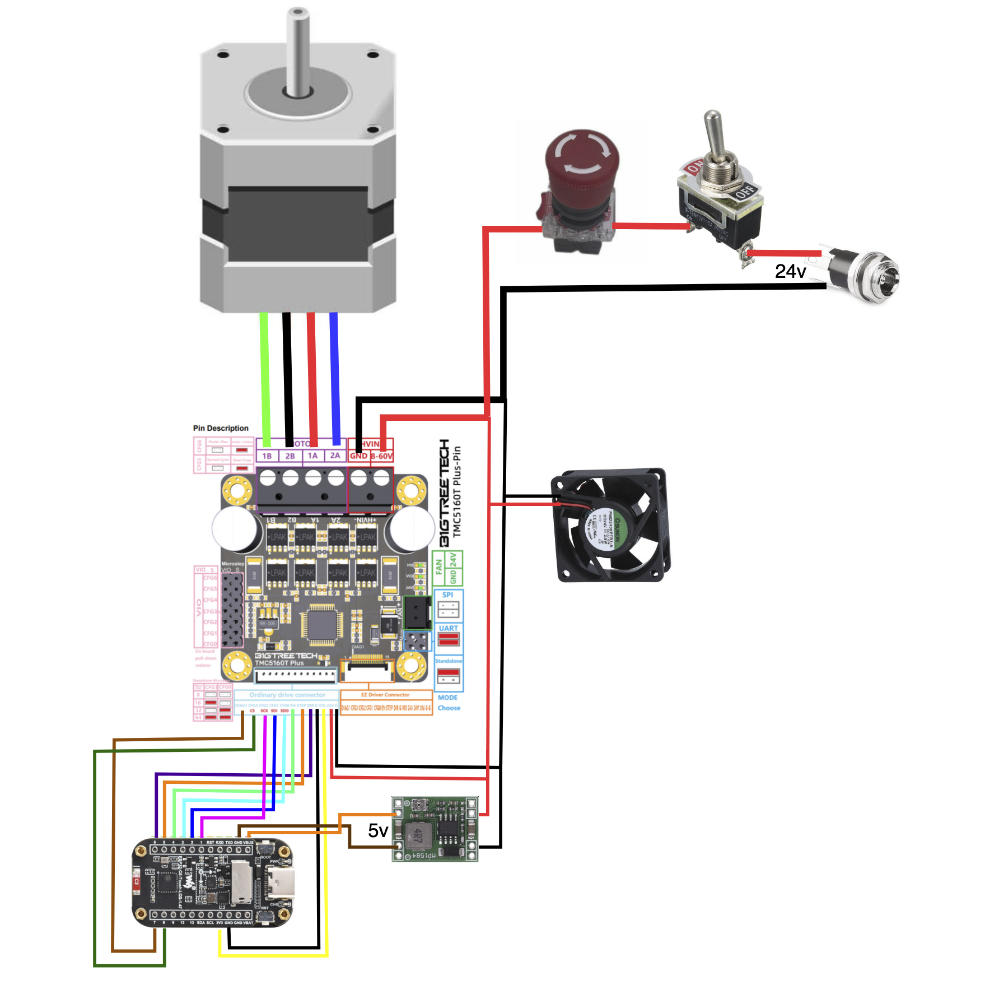

# AutoLee

**Automated Lee APP conversion — ESP32-C6 firmware with touchscreen UI and web control.**

AutoLee converts a manual Lee APP into a fully automated decapping machine using a stepper motor, sensorless homing, and StallGuard jam detection. It runs on a tiny 1.47" touchscreen ESP32-C6 module and can also be controlled from any phone/computer via its built-in web interface.

Find the 3D-printable parts here: https://makerworld.com/en/models/2529369-autolee-conversion-kit

Support my work: https://buymeacoffee.com/kl.design

> **By K.L Design**

### Two power versions

| Version | Status | Summary |
|---|---|---|
| **36 V** | **Recommended** | 36 V motor supply, XT60 input, enclosed open-frame PSU. The higher supply voltage gives the motor more torque, so the press is stronger and handles load better. |
| **24 V** | Supported | The original build — 24 V 5 A power brick and DC jack. Still fully supported by the same firmware. |

Both versions run **the same firmware** — no build flags or settings to change. The MakerWorld listing contains the parts for both, including a dedicated 36 V print profile and the PSU casing.

---

## ⚠️ SAFETY WARNING — READ BEFORE BUILDING OR OPERATING

**This machine will crush fingers and hands without breaking a sweat.** It is a motorized press driven by a NEMA 23 stepper motor with significant torque. It does not know or care if something is in the way.

- **NEVER run this machine unattended.**
- **NEVER allow children near the machine, whether it is running or not.**
- **Keep your hands and fingers away from the machine at ALL times when it is powered on.**
- **Treat it like any industrial press — it can and will cause serious injury if misused.**

The stall detection and jam protection features are designed to detect brass getting stuck in the machine — nothing more. They will **not** detect or protect your fingers and hands. They were never designed for that. And even for brass jams, they can fail, be misconfigured, or react too slowly. **Do not rely on software to protect your body.**

## ⚡ MAINS VOLTAGE WARNING — 36 V VERSION

**The 36 V version uses an open-frame power supply with exposed screw terminals for 230 V AC mains. Mains voltage can kill you. Mistakes in this wiring can cause electric shock, fire, and death.**

- **Only do the mains wiring if you know exactly what you are doing.** If you are in any doubt, have a qualified electrician do it.
- **Follow all local laws and regulations** for mains wiring where you live.
- **Never work on the PSU while it is plugged in.** Unplug it and wait before touching anything — open-frame supplies can hold a dangerous charge in their capacitors after being disconnected.
- **Always connect protective earth** to the PSU's earth (⏚) terminal.
- **Never power the PSU unless it is fully closed inside its printed casing.** Never run it open on the bench.
- Use strain relief on the mains cable. Crimp ferrules on clamp terminals and insulated fork or ring terminals on screw terminals — no bare, tinned or loose strands.
- Double-check every connection before plugging in for the first time.

**LIABILITY DISCLAIMER:** This project is provided as-is with absolutely no warranty of any kind. The author(s) accept no responsibility or liability for any injury, death, damage, or loss resulting from building, modifying, wiring (including mains wiring), or operating this machine. You build and use it entirely at your own risk.

---

## Features

### Motion & Calibration
- **Sensorless calibration** — automatically finds the UP and DOWN mechanical stops using TMC5160 StallGuard, no limit switches needed
- **Adjustable endpoints** — fine-tune UP and DOWN positions in ±1/10/100 step increments after calibration
- **Fast ramp profile** — 800,000 steps/s² accel/decel (`RUN_DECEL`) for maximum cruise time and StallGuard coverage
- **Safe return-home** — after a jam or stall, creeps back to the UP stop at calibration speed with stall detection
- **Calibrate after every power-up** — calibration is deliberately not saved, because the motor's position reference is lost when power is removed (including after an E-stop)

### Speed Profiles
- **Three preset profiles** — Slow (15 kHz), Normal (30 kHz), Fast (40 kHz)
- **Per-profile StallGuard trip** — SG readings depend heavily on speed, so each profile has its own trip value
- **One-tap switching** — change profile from the touchscreen or web UI; a switch while running is applied cleanly at the next direction change

### Auto SG (jam detection setup)
- **Automatic trip measurement** — runs 12 strokes per profile with detection off, records the highest SG reading and sets each trip to that value + 1
- **Press lockout** — the press will not run until all three trips are set (by Auto SG or by hand). Trips ship as 0 because the right values depend on the individual machine: supply voltage, motor, current, and mechanics
- **Stays valid only for the conditions it measured** — the trips are stored together with the run current and profile speeds. Changing the current or work zone logs a reminder to re-run Auto SG; a firmware update that changes a profile speed clears that trip and locks the press until Auto SG is run again
- **Floor warning** — if a profile's SG only ever read at the floor (0/1), it is flagged **JAM DETECT LIMITED** on the display and web page, since detection there is limited

### Motor Current
- **Adjustable run current** — 1,000–4,500 mA via web slider (default 3,500 mA)
- **Overcurrent warning** — values above 4,000 mA show a warning (exceeds motor rating, ensure cooling)
- **Live adjustment** — takes effect immediately, no restart needed

### Jam Detection & Protection
- **Runtime StallGuard monitoring** — reads SG2 via median-of-5 filtered SPI during operation
- **Polarity note** — on this machine SG_RESULT **rises** under load, so a jam is detected when SG goes **above** the trip. **Lower trip = more sensitive, 0 = off.** This is the opposite of the TMC5160 datasheet, and it is intentional
- **Consecutive-reading confirmation** — two consecutive high readings are required to declare a jam (rejects single spikes)
- **Work zone blanking** — skips SG monitoring near the DOWN endpoint where primer seating resistance is normal
- **Accel/decel blanking** — ignores SG during speed transitions
- **Automatic backoff** — on jam detection, the motor stops and backs off 1,000 steps before showing the jam screen
- **Jam recovery screen** — one-button return-home using the same sensorless homing as calibration
- **Per-stroke logging** — min/max SG for every stroke is logged, and the last stroke's values are shown on the web Configuration page

### Batch Run
- **Set a target count** (1–9999, 0 = off) and the machine stops automatically when done
- **Progress display** — remaining count shown on the main screen during batch operation
- **Works with all profiles** — batch runs at whatever speed profile is active

### Counter
- **Stroke counter** — counts each completed down-up cycle, displayed large on the main screen (display caps at 9999; batch counting is not affected by the cap)
- **Resettable** from touch UI or web interface

### Settings Persistence
- Profile, SG trips, run current, work zone, endpoint offsets, batch target, counter and WiFi on/off are saved to flash automatically
- Saves happen only while idle, so a continuous run never writes flash

### Touch UI (172×320 LVGL)
- **Main screen** — counter, active speed profile, status warnings (NOT CALIBRATED / RUN AUTO SG / JAM DETECT LIMITED), batch remaining, RUN/STOP, Batch Run and Settings buttons
- **Settings** — Calibrate, Auto SG, Config, Reset Count
- **Config** — Speed, Endpoints, Stall Guard, WiFi Info
- **Speed** — three profile buttons with the active one highlighted, info card showing Hz + SG trip, warning symbol on floor-limited profiles
- **Endpoints** — raw and effective endpoint values, buttons to edit UP and DOWN (±1/10/100)
- **Stall Guard** — adjust the SG trip for the active profile with ±1/±5 buttons
- **Batch Run** — set target count with ±1/10/100 buttons, start batch
- **Jam screen** — warning display with one-button return home
- **WiFi** — shows SSID and IP, WiFi on/off switch, Reset WiFi button

### Web Interface (5-page layout)
- **Full control from any browser** — responsive dark-theme UI works on phone and desktop
- **Real-time updates** — Server-Sent Events (SSE) push state changes at 250 ms intervals
- **Main page** — status, counter, RUN/STOP, jam recovery, calibrate, reset counter, batch run controls, speed profile selector
- **Configuration page** — motor current slider (1,000–4,500 mA with overcurrent warning), endpoint tuning, per-profile SG trip inputs with last-stroke min/max SG, Auto SG, work zone adjustment
- **Log page** — 300-line scrollable log with real-time streaming and clear button
- **Firmware page** — drag-and-drop OTA `.bin` upload with progress bar
- **WiFi page** — connection status, SSID and IP, change credentials, reset to AP mode, radio on/off
- **Footer navigation** — links on every page to jump between all five pages

### WiFi & Networking
- **Off by default on a new install** — turn it on from the touchscreen (Settings → Config → WiFi Info → **WiFi On**). Turning WiFi on reboots the device (~2 s); turning it off is immediate
- **Auto-connect** — attempts saved credentials on boot, falls back to AP if it fails
- **Captive portal** — open AP mode (`AutoLee-Setup`, no password) with DNS redirect so any device gets the setup page automatically
- **Network scanner** — scans available WiFi networks and presents them in a dropdown
- **Auto-reconnect** — monitors the connection and reconnects if the network drops
- **ArduinoOTA support** — update firmware from PlatformIO/Arduino IDE over the network (hostname: `autolee`, password: `autolee`)

### Power
- **36 V version** — 36 V motor supply via XT60, stepped down 36 V → 24 V (fan, driver 24 V pin) → 5 V (ESP32-C6)
- **24 V version** — 24 V via DC jack, stepped down 24 V → 5 V
- **Power switch and E-stop** in series on the main supply line — the E-stop cuts all power to the machine, motor and logic

---

## File Structure

The firmware is split into modular files for maintainability. All files must be in the same sketch folder.

| File | Purpose |
|---|---|
| `AutoLee.ino` | Main entry point — globals, `setup()`, `loop()`, settings persistence, include order, changelog |
| `config.h` | All tuning constants, pin definitions, speed profiles |
| `motion.h` | Motion control, stall detection, calibration, Auto SG, creep home |
| `ui_touch.h` | LVGL touch UI — screen builders, helpers, event handlers |
| `web_server.h` | Web server, API endpoints, SSE broadcast, HTML, OTA upload |
| `wifi_ota.h` | WiFi connection, supervision, captive portal, ArduinoOTA |
| `lv_conf.h` | LVGL configuration — display size, memory pool, enabled features, font selections |

The Arduino IDE compiles everything as a single translation unit. Include order in `AutoLee.ino` resolves all dependencies: `config.h` → globals → `motion.h` → `ui_touch.h` → `wifi_ota.h` → `web_server.h`.

---

## Bill of Materials

> **Support this project:** The product links below are affiliate links. If you purchase through them, I earn a small commission at no extra cost to you — it's a simple way to help fund continued development of AutoLee. Thank you!

### Common Parts (both versions)

#### Electronics

| # | Component | Specs | Link |
|---|-----------|-------|------|
| 1 | WaveShare 1.47" ESP32-C6 | Touchscreen controller & UI | [Amazon.se](https://www.amazon.se/dp/B0F8B845Y6?tag=kldesign-21) · [Amazon.com](https://www.amazon.com/dp/B0FC5LWVXG?tag=kldesign00-20) |
| 2 | TMC5160T Plus | Silent stepper driver with StallGuard2 (8–60 V) | [Amazon.se](https://www.amazon.se/dp/B0D5HQWW1C?tag=kldesign-21) · [Amazon.com](https://www.amazon.com/dp/B0CHFK7VBL?tag=kldesign00-20) |

#### Mechanical

| # | Component | Specs | Link |
|---|-----------|-------|------|
| 3 | NEMA 23 Stepper Motor | 2.4 Nm, 4.0 A, 57×57×82 mm, 8 mm shaft | [Amazon.se](https://www.amazon.se/dp/B091C37FJ2?tag=kldesign-21) · [Amazon.com](https://www.amazon.com/dp/B091C37FJ2?tag=kldesign00-20) |
| 4 | Shaft Coupling | Motor-to-leadscrew (8 mm to 10 mm) | [Amazon.se](https://www.amazon.se/dp/B07CLLW7Z3?tag=kldesign-21) · [Amazon.com](https://www.amazon.com/dp/B08QV1QN81?tag=kldesign00-20) |
| 5 | Ball Screw Kit SFU1605 250 mm | 250mm SFU1605 BK12/BF12 10 mm Shaft | [Amazon.de](https://www.amazon.de/dp/B08WRJRM22?tag=kldesign-21) · [Amazon.com](https://www.amazon.com/dp/B09BQSWPM4?tag=kldesign00-20) |

#### Controls

| # | Component | Specs | Link |
|---|-----------|-------|------|
| 6 | On/Off Switch | Panel mount | [Amazon.se](https://www.amazon.se/dp/B07GDCNXKP?tag=kldesign-21) · [Amazon.com](https://www.amazon.com/dp/B078KBC5VH?tag=kldesign00-20) |
| 7 | Emergency Stop | Button | [Amazon.se](https://www.amazon.se/dp/B0FFMTCFLK?tag=kldesign-21) · [Amazon.com](https://www.amazon.com/dp/B0FFMTCFLK?tag=kldesign00-20) |

#### Cooling

| # | Component | Specs | Link |
|---|-----------|-------|------|
| 8 | Fan | 24 V, 40×40×20 mm | [Amazon.se](https://www.amazon.se/dp/B00MNJD8BE?tag=kldesign-21) · [Amazon.com](https://www.amazon.com/dp/B07B66DJYX?tag=kldesign00-20) |

#### Wiring Supplies

| # | Component | Specs | Link |
|---|-----------|-------|------|
| 9 | Silicone Wire | 18 AWG, power wiring (PSU → driver, step-downs) | [Amazon.com](https://www.amazon.com/Silicone-Electrical-Conductor-Parallel-Flexible/dp/B07FMRDP87?tag=kldesign00-20) |
| 10 | Silicone Wire | 24 AWG, flexible stranded, signal wiring | [Amazon.com](https://www.amazon.com/TUOFENG-Wire-Stranded-Flexible-Silicone-Different/dp/B07G2BWBX8?tag=kldesign00-20) |
| 11 | Dupont Connector Kit + Crimping Tool | 2.54 mm connectors, housings, and ratcheting crimper | [Amazon.com](https://www.amazon.com/Crimping-Connector-Assortment-Ratcheting-0-25-1-5mm%C2%B2/dp/B0FJ8LCZ9W?tag=kldesign00-20) |
| 12 | Ferrule Connector Kit + Crimping Tool | For power and motor wires to the TMC5160 clamp terminals | [Amazon.com](https://www.amazon.com/Preciva-Hexagonal-Self-adjustable-Terminals-Connectors/dp/B0D3D65VZT?tag=kldesign00-20) |
| 12b | Insulated Fork Terminals (36 V version) | For the PSU screw terminals — size to the terminal screw; flanged/locking type recommended | [Amazon.se]([AMAZON_SE_FORK_TERMINALS]) · [Amazon.com]([AMAZON_COM_FORK_TERMINALS]) |

### 36 V Version — Additional Parts (recommended)

| # | Component | Specs | Link |
|---|-----------|-------|------|
| 13 | Power Supply | 36 V, 10 A, open frame (enclosed in printed PSU casing) | [Amazon.se](https://www.amazon.se/dp/B0BX2HH4LX?tag=kldesign-21) · [Amazon.com](https://www.amazon.com/dp/B08LDC41B6?tag=kldesign00-20) |
| 14 | IEC C14 Panel Inlet | Mains inlet for the PSU casing | [Amazon.se](https://www.amazon.se/dp/B0D4MB1321?tag=kldesign-21) · [Amazon.com](https://www.amazon.com/Panel-Adapter-Connector-Socket-MXR/dp/B07DCXKNXQ?tag=kldesign00-20) |
| 15 | Mains Power Cable | 230 V, 3-core earthed, IEC C13 plug | [Amazon.se](https://www.amazon.se/dp/B06WWBPCN8?tag=kldesign-21) · [Amazon.com]([AMAZON_COM_C13_CABLE]) |
| 16 | XT60 Connectors | Panel-mount male on AutoLee, female on the PSU lead | [Amazon.se]([AMAZON_SE_XT60]) · [Amazon.com]([AMAZON_COM_XT60]) |
| 17 | Step-down 36 V → 24 V | Adjustable buck converter — **must be set to 24 V before connecting loads** | [Amazon.se](https://www.amazon.se/dp/B0DK6M63YL?tag=kldesign-21) · [Amazon.com]([AMAZON_COM_36V_24V_BUCK]) |
| 18 | Step-down 24 V → 5 V | Pololu #5267 | [Electrokit](https://www.electrokit.com/en/switchregulator-step-down-5-72v-in-/-5v-ut) · [International]([POLOLU_5267_INTERNATIONAL]) |
| 19 | Mains-rated wire | Inlet → PSU terminals, [SPEC] | [LINK_MAINS_WIRE] |

> **C13 vs C14:** the panel-mount socket on the PSU casing is an **IEC C14 inlet**. The power cable that plugs into it has a **C13** plug (a standard "computer/kettle" style cable).
>
> **XT60 orientation:** put the **female** XT60 on the PSU lead (the side that is live) and the **male** panel connector on the AutoLee, so no live pins are ever exposed.

### 24 V Version — Additional Parts

| # | Component | Specs | Link |
|---|-----------|-------|------|
| 20 | Power Supply | 24 V, 5 A DC | [Amazon.se](https://www.amazon.se/dp/B0CNPMCP6F?tag=kldesign-21) · [Amazon.com](https://www.amazon.com/dp/B0BY7P38Q5?tag=kldesign00-20) |
| 21 | DC Power Jack | 2.5 mm socket | [Amazon.se](https://www.amazon.se/dp/B081CM1G4M?tag=kldesign-21) · [Amazon.com](https://www.amazon.com/dp/B09W9SJ1B6?tag=kldesign00-20) |
| 22 | Buck Converter | 24 V → 5 V | [Amazon.se](https://www.amazon.se/dp/B07DJ5HZ7G?tag=kldesign-21) · [Amazon.com](https://www.amazon.com/dp/B0DC3N7PMY?tag=kldesign00-20) |

### Hardware (Fasteners & Inserts)

#### Bolts / Screws

| Qty | Size | Used For |
|-----|------|----------|
| 15 pcs | M4 x 16mm | Motor, Motor mount, Backplane upper, Backplane lower |
| 11 pcs | M5 x 40mm | Ballscrew mounts, Sled clamp |
| 4 pcs | M5 x 25mm | Sled mount |
| 1 pcs | M4 x 20mm | Display mount |
| 4 pcs | M3 x 30mm | 24V Fan |
| 4 pcs | M3 x 5mm | TMC5160T |
| 1 pcs | M3 x 10mm | Driverhousing mounting to backplane|
| 2 pcs | M3 x 10mm | Driverhousinglid|
| 4 pcs | M2 x 5mm | Display |

#### Lock Nuts

| Qty | Size | Used For |
|-----|------|----------|
| 3 pcs | M5 Lock nut | Sled clamp |
| 4 pcs | M3 Lock nut | 24V Fan |

#### Heat Inserts

| Qty | Size | Used For | Link |
|-----|------|----------|------|
| 16 pcs | M4 Heat insert | Motor, Motor mount, Backplane upper, Backplane lower, Display mount | [Amazon.se](https://www.amazon.se/dp/B09MTTC7S9?tag=kldesign-21) · [Amazon.com](https://www.amazon.com/dp/B0FCXXW62N?tag=kldesign00-20) ¹ |
| 8 pcs | M5 Heat insert | Ballscrew mount | [Amazon.se](https://www.amazon.se/dp/B07YSVXWS8?tag=kldesign-21) · [Amazon.com](https://www.amazon.com/dp/B0FCXXW62N?tag=kldesign00-20) ¹ |
| 5 pcs | M3 Heat insert | TMC5160T mount, Driverhousing to backplane | [Amazon.se](https://www.amazon.se/dp/B08BCRZZS3?tag=kldesign-21) · [Amazon.com](https://www.amazon.com/dp/B0FCXXW62N?tag=kldesign00-20) ¹ |

> ¹ The US link is a bundle kit that includes M3, M4, and M5 inserts.

#### 36 V Version — Additional Fasteners

The 36 V version uses the same hardware as above (the XT60 mount replaces the DC jack mount), plus:

| Qty | Size | Used For |
|-----|------|----------|
| 2 pcs | M3 x 8mm | 36 V → 24 V step-down |
| 2 pcs | M3 Heat insert | 36 V → 24 V step-down |

---

## Wiring

### ESP32-C6 → TMC5160T Plus (SPI) — both versions

| ESP32-C6 Pin | TMC5160 Pin | Function |
|:---:|:---:|---|
| GPIO 1 | SCK | SPI Clock |
| GPIO 2 | SDI (MOSI) | SPI Data In |
| GPIO 3 | SDO (MISO) | SPI Data Out |
| GPIO 8 | CS | SPI Chip Select |
| GPIO 4 | EN | Enable (active low) |
| GPIO 5 | STEP | Step pulse |
| GPIO 6 | DIR | Direction |
| GPIO 7 | DIAG1 | StallGuard diagnostic output |
| 3V3 | VIO | Logic voltage |
| GND | GND | Logic ground |

> **Important:** The display and TMC5160 share the SPI bus (GPIO 1, 2). The firmware manages chip-select lines (GPIO 8 for TMC, GPIO 14 for display) to avoid bus conflicts. The display CS is forced high before every StallGuard SPI read.

### Power — 36 V Version (recommended)

| Connection | Details |
|---|---|
| Mains 230 V → C14 inlet → PSU L / N / ⏚ | Inside the PSU casing only — see the mains warning above |
| PSU 36 V → XT60 | 18 AWG lead from PSU casing to the AutoLee |
| XT60 → On/Off switch → E-stop | Main supply line into the machine |
| 36 V → TMC5160 HVIN (8–60 V) | Motor power |
| 36 V → 36→24 V step-down IN | |
| 24 V → Fan | Direct 24 V to cooling fan |
| 24 V → TMC5160 drive connector **24V** pin | **Must come from the 24 V rail — never 36 V** |
| 24 V → Pololu 24→5 V IN | |
| Pololu 5 V OUT → ESP32-C6 5 V | Logic power |
| GND | Common ground between all boards |

> **⚠️ Set the 36 V → 24 V step-down before connecting anything to it.** The module is adjustable and may not arrive set to 24 V. Power it from 36 V with **no load connected**, measure the output with a multimeter, turn the trim pot until it reads **24.0 V**, and only then connect the fan, the Pololu and the TMC5160 24V pin. A mis-set step-down can put up to 36 V on parts rated for 24 V.
>
> **⚠️ TMC5160 24V pin:** BIGTREETECH specifies that the voltage on the driver's control-connector 24V pin must not exceed 24 V, whatever the motor supply voltage — exceeding it damages the driver. Only the HVIN terminal takes 36 V.

### Power — 24 V Version

| Connection | Details |
|---|---|
| 24 V PSU → DC jack → On/Off switch → E-stop | Main supply line into the machine |
| 24 V → TMC5160 HVIN | Motor power (24 V) |
| 24 V → TMC5160 drive connector 24V pin | |
| 24 V → Buck converter IN | Feeds the buck converter |
| Buck converter OUT (5 V) → ESP32-C6 5 V | Logic power |
| 24 V → Fan | Direct 24 V to cooling fan |
| GND | Common ground between all boards |

---

## Software Setup

### Dependencies (Arduino / PlatformIO)

| Library | Version | Install | Purpose |
|---|---|---|---|
| `LVGL` | v8.4.0 | Online | Touchscreen UI framework |
| `GFX_Library_for_Arduino` | v1.5.9 | Online | ST7789 display driver |
| `TMCStepper` | — | Online | TMC5160 SPI communication |
| `FastAccelStepper` | — | Online | Step pulse generation with acceleration |
| `ESPAsyncWebServer` + `AsyncTCP` | — | Online | Web server & SSE |
| `ArduinoOTA` | — | Online | Over-the-air firmware updates |
| `DNSServer` | — | Online | Captive portal redirect |
| `esp_lcd_touch_axs5106l` | — | **Offline** | AXS5106L touch controller driver |

> **Note:** The `esp_lcd_touch_axs5106l` library is **not available** in the Arduino Library Manager. You must install it manually from Waveshare's demo package — see step 3 below.

### Build & Flash

1. Clone this repo
2. Install all "Online" libraries above via the Arduino Library Manager
3. Install the touch driver **offline**:
   - Download the [Waveshare ESP32-C6-Touch-LCD-1.47 demo package](https://www.waveshare.com/wiki/ESP32-C6-Touch-LCD-1.47)
   - Find the `esp_lcd_touch_axs5106l` library folder inside the package
   - Copy it to your Arduino `libraries` directory
4. Set up LVGL:
   - Copy `lv_conf.h` from this repo to sit **next to** your `lvgl` library folder (not inside it)
   - Copy the `demos` folder from inside the LVGL library into its `src` folder
5. Open `AutoLee.ino` in Arduino IDE or PlatformIO — all `.h` files must be in the same folder as the `.ino`
6. Select board: **ESP32-C6**
7. Set partition scheme: **Minimal SPIFFS (1.9 MB APP with OTA/190 KB SPIFFS)** — the firmware is too large for the default partition layout
8. Compile and flash

## Flash Pre-Compiled Binary (No Arduino IDE Required)

If you don't want to set up the Arduino IDE and compile the firmware yourself, you can flash a pre-built binary directly to the ESP32-C6 using a web browser.

### What You Need

- A **Chrome** or **Edge** browser (Web Serial is not supported in Firefox or Safari)
- A **USB-C cable** connected to the Waveshare ESP32-C6 board
- The merged firmware `.bin` file from the [`/Firmware`](Firmware/) folder in this repo

### Steps

1. Download the latest `AutoLee.vX.XX_merged.bin` from the [`/Firmware`](Firmware/) folder
2. Open the [**Espressif Web Flasher**](https://espressif.github.io/esptool-js/) in Chrome or Edge
3. Click **Connect** and select the port for your ESP32-C6
4. In the **Program** section, enter **`0x0`** in the Flash Address field
5. Click the file picker next to the address and select the downloaded `.bin` file
6. Set Flash Mode as **dio** and Flash Size as **4MB**
7. Click **Program**
8. Wait for flashing to complete — progress will show in the Console section at the bottom
9. After programming is complete click the **rst** button on the esp32 board to reboot
10. System should now be online

**Tip:** If the board doesn't show up as a COM port, hold the **BOOT** button on the Waveshare board while plugging in USB, then release after connecting. You may also need to install the [CH343 USB driver](https://www.wch-ic.com/downloads/CH343SER_ZIP.html) if your OS doesn't recognize the board.

### Updating Firmware Later

Once AutoLee is on your WiFi, go to the web UI → **Firmware** page and drag-and-drop the **update** file, `AutoLee.vX.XX_update.bin` (not the merged binary). The merged binary is only needed for the initial USB flash.

### OTA Updates

After first flash, firmware can be updated two ways:

- **Web UI** — open the AutoLee web interface, go to the Firmware page, drag and drop the `AutoLee.vX.XX_update.bin` file
- **ArduinoOTA** — hostname `autolee`, password `autolee`

---

## First-Time Setup

1. **(36 V version)** Set the 36 V → 24 V step-down to 24.0 V **before** connecting its loads — see [Power — 36 V Version](#power--36-v-version-recommended).
2. **Power on.** The main screen shows **NOT CALIBRATED**.
3. **Enable WiFi (optional).** WiFi is off on a new install. Go to Settings → Config → WiFi Info → **WiFi On** — the device reboots and starts the `AutoLee-Setup` captive portal if no network is saved. Connect to it and choose your network.
4. **Calibrate.** Settings → **Calibrate**. The press finds its UP and DOWN stops. This has to be done after **every** power-up.
5. **Run Auto SG.** **Empty the press first** — nothing is detecting while it measures. Settings → **Auto SG** (or the Configuration page on the web). It takes about a minute and sets the jam detection trip for all three profiles. The press stays locked until this has been done once.
6. **Run.**

**Re-run Auto SG** whenever you change the supply voltage (e.g. converting from 24 V to 36 V), the run current, the work zone, or the mechanics. The trips are only valid for the conditions they were measured under.

---

## Configuration

Key constants are in `config.h`:

| Constant | Default | Description |
|---|---|---|
| `profiles[0]` (Slow) | 15,000 Hz / trip 0 | Low speed — trip set by Auto SG |
| `profiles[1]` (Normal) | 30,000 Hz / trip 0 | Balanced — trip set by Auto SG |
| `profiles[2]` (Fast) | 40,000 Hz / trip 0 | High speed — trip set by Auto SG |
| `RUN_CURRENT_MA` | 3,500 mA | Motor run current (adjustable 1,000–4,500 via web UI) |
| `RUN_DECEL` | 800,000 | Accel/decel rate (steps/s²) |
| `CAL_CURRENT_MA` | 3,200 | Calibration current (mA, fixed) |
| `CAL_SPEED_HZ` | 8,000 | Calibration speed (Hz) |
| `SGT_VALUE` | −1 | StallGuard threshold (COOLCONF.SGT), shared by run, calibration and homing |
| `SG_FILTER` | false | StallGuard filter — must stay off; it averages away the short load spike |
| `RUN_SG_TRIP_NEEDED` | 2 | Consecutive high SG readings needed to declare a jam |
| `RUN_BACKOFF_STEPS` | 1,000 | Steps to back off after a jam |
| `SG_AUTO_STROKES` | 12 | Strokes measured per profile during Auto SG |
| `SG_AUTO_MARGIN` | 1 | Auto SG trip = measured max + this |
| `SG_WORK_ZONE_STEPS` | 5,500 | SG blanking zone near DOWN endpoint (adjustable via web UI) |
| `DOWN_OFFSET_DEFAULT` | −500 | Default DOWN endpoint offset after calibration |
| `LOG_LINES` | 300 | Log buffer size |

> **SG polarity:** a jam is `sg > trip` — **lower trip = more sensitive, 0 = off**. This is the opposite of the TMC5160 datasheet and was confirmed on the machine; following the datasheet broke jam detection in v1.11–v1.19. Don't "fix" it.

---

## API Reference

`/api/state` is `GET`; all other endpoints are `POST`.

| Endpoint | Parameters | Description |
|---|---|---|
| `GET /api/state` | — | Returns full JSON state |
| `/api/toggle_run` | — | Start or stop running |
| `/api/profile` | `idx=0\|1\|2` | Switch speed profile |
| `/api/sg_trip` | `value=N` or `delta=N`, `&profile=N` (optional) | Set or adjust SG trip (0–1023); targets active profile by default |
| `/api/current` | `ma=N` | Set motor run current (1,000–4,500 mA) |
| `/api/work_zone` | `delta=N` | Adjust work zone blanking steps |
| `/api/endpoint` | `which=up\|down` `&delta=N` | Adjust endpoint offset |
| `/api/batch` | `delta=N` or `action=start\|clear` | Adjust batch target or start/clear |
| `/api/action` | `do=calibrate\|auto_sg\|return_home\|reset_counter` | Trigger actions |
| `/api/wifi` | `ssid=...` `&pass=...` | Save WiFi credentials and reboot |
| `/api/wifi_reset` | — | Clear saved WiFi, reboot to AP mode |
| `/api/wifi_enable` | `on=0\|1` | Turn WiFi off (immediate) or on (reboots) |
| `/api/ota` | multipart `.bin` upload | Firmware update |
| `/api/log_clear` | — | Clear the log buffer |

SSE stream available at `/events` — pushes JSON state every 250 ms and log lines as `log` events.

---

## Version History

### Hardware

| Revision | Changes |
|---|---|
| **36 V** | 36 V motor supply (recommended) — XT60 input, 36 V → 24 V → 5 V step-down chain, open-frame 36 V 10 A PSU in a printed casing with C14 mains inlet, dedicated 36 V print profile on MakerWorld |
| **24 V** | Original build — 24 V 5 A PSU, DC jack, 24 V → 5 V buck |

### Firmware

| Version | Changes |
|---|---|
| **v1.32** | Slow profile back to 15 kHz (Normal 30, Fast 40) |
| **v1.31** | "JAM DETECT LIMITED" warning for profiles where SG sits at the floor; visible feedback on Reset Count |
| **v1.30** | Profile speeds changed to 20/30/40 kHz; each trip saved with its speed and cleared at boot if the speed no longer matches |
| **v1.29** | Auto SG no longer aborts when SG sits at the floor (0/1) at speed, e.g. 24 V on Normal/Fast; floor readings logged |
| **v1.28** | Chopper timing: TBL=2, TOFF=5 |
| **v1.27** | Jam-detection lockout derived from the trips alone; reboot timing fix so OTA "OK" isn't cut off |
| **v1.26** | Auto SG fixes: exempt from lockout, STOP stays live, strokes don't count; all three trips required to unlock; run current stored with trips, re-run reminder on change |
| **v1.25** | SG trips default to 0; press locked until Auto SG has run (or trips set by hand) |
| **v1.24** | Hard-coded SG values removed from the web UI (they are machine-specific) |
| **v1.23** | Auto SG calibration |
| **v1.22** | Turning WiFi on now reboots — the web server did not reliably come back otherwise |
| **v1.21** | Default SG trips updated to confirmed values (later replaced by Auto SG) |
| **v1.20** | Stall polarity restored to `sg > trip` (v1.8 behaviour); SG filter off again; per-stroke max SG logged |
| **v1.19** | Per-stroke SG summary also printed on stop and jam |
| **v1.18** | Runtime SGT, calibration SGT and relative detector removed — back to one absolute trip per profile |
| **v1.16** | SG read and logged even with detection off; per-stroke minimum SG logged |
| **v1.15** | LVGL memory pool raised 48 → 80 KB (fixed silent black-screen hang); LVGL logging enabled |
| **v1.14** | WiFi on/off switch on touch screen and web; off by default on new installs |
| **v1.13** | Runtime-adjustable SGT and relative stall detection (both removed again in v1.18) |
| **v1.12** | Switching profile mid-run no longer causes a false jam — applied at the next direction change |
| **v1.11** | Settings saved to flash; WiFi supervision/reconnect; web handlers no longer touch motion from the network task; batch/calibration robustness fixes |
| **v1.9** | MicroPlyer interpolation enabled; chopper off-time 4 |
| **v1.8** | Firmware split into modular files (`config.h`, `motion.h`, `ui_touch.h`, `web_server.h`, `wifi_ota.h`) for maintainability — no functional changes from v1.7 |
| **v1.7** | WiFi Info moved to Configuration sub-menu; Reset WiFi button on WiFi info screen; speed profile buttons resized to fit display; WiFi info centered in card |
| **v1.6** | Adjustable motor current (1,000–4,500 mA) via web; multi-page web UI (Main, Configuration, Log, Firmware, WiFi); touch UI restructured (Settings → Configuration sub-menu); WiFi page shows SSID + IP; SG text inputs with auto-submit on blur; profiles retuned |
| **v1.5** | Speed profiles (Slow/Normal/Fast) replace speed slider; per-profile SG thresholds; profile API |
| **v1.4** | Captive portal WiFi; work zone SG blanking; RUN_DECEL 800k; median-of-5 SPI filter; sliding counter stall detection; redesigned web UI |
| **v1.3** | Batch run; jam screen with return-home; runtime StallGuard monitoring; web log viewer |
| **v1.2** | Web UI with SSE; OTA updates; endpoint tuning; WiFi AP/STA |
| **v1.1** | Sensorless calibration; basic touch UI |
| **v1.0** | Initial release |

---

## License

This project is licensed under the [Creative Commons Attribution-NonCommercial 4.0 International License](https://creativecommons.org/licenses/by-nc/4.0/).

You are free to use, modify, and share this work for personal, non-commercial purposes, provided you give appropriate credit. Commercial use is not permitted without prior written permission.

Commercial use — including selling devices, kits, or services based on this project — is prohibited without prior written permission from the author.

THIS SOFTWARE IS PROVIDED "AS IS", WITHOUT WARRANTY OF ANY KIND. USE AT YOUR OWN RISK.

Copyright (c) 2025 K.L Design
